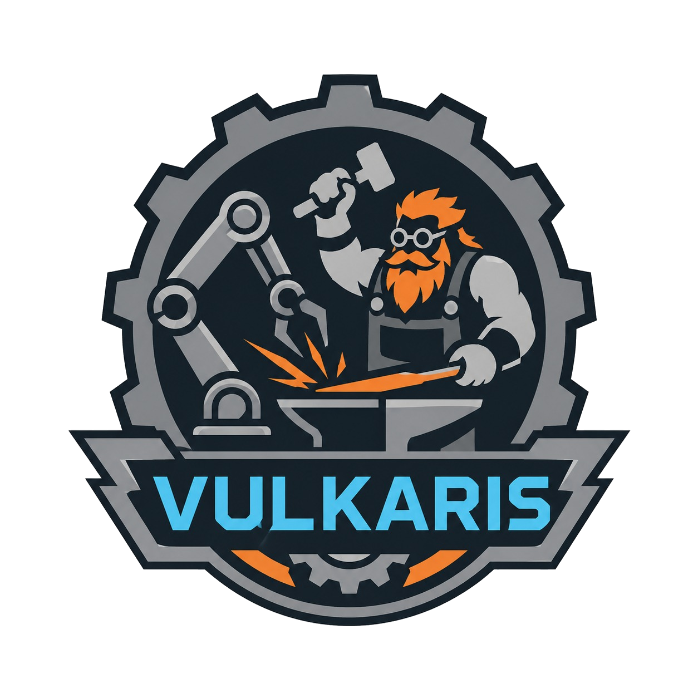

<p align="center">
  
</p>

<h1 align="center">Vulkaris Robotics Team</h1>

<p align="center">
  <strong>Transformando ideias em robôs, tecnologia em aprendizado e inovação em movimento.</strong>
</p>

<p align="center">
  
  
  
  
</p>

---

## 📖 Sobre

Site institucional da **Vulkaris Robotics Team** — uma equipe apaixonada por robótica, programação e inovação tecnológica. O site apresenta a equipe, áreas de atuação, projetos, galeria de fotos e informações de contato.

### ✨ Destaques do Design

- 🎨 **Dark futurista** com glassmorphismo e efeitos de glow neon
- 🌈 Paleta **ciano (#4FC3F7) + laranja (#FF6B1A)** sobre fundo escuro
- ✏️ Tipografia premium com **Orbitron** (display) + **Inter** (body)
- 🎬 Animações ricas: scroll reveal, partículas flutuantes, anéis orbitais, scan line
- 📱 Totalmente **responsivo** (4 breakpoints)
- 🌗 Suporte a **dark/light mode**
- ♿ **Acessibilidade** completa (ARIA, roles, `prefers-reduced-motion`)

---

## 🛠️ Stack Tecnológica

| Camada | Tecnologia |
|--------|-----------|
| Bundler | [Vite](https://vite.dev/) 8.x |
| Framework | [React](https://react.dev/) 19.x |
| Linguagem | JavaScript (JSX) — ES Modules |
| Estilos | Vanilla CSS (sem Tailwind, sem SASS) |
| Fontes | [Google Fonts](https://fonts.google.com/) (Orbitron + Inter) |
| Ícones | SVG inline (componentes React) |
| Linting | [ESLint](https://eslint.org/) 10.x |

---

## 📁 Estrutura do Projeto

```
vulkaris/
├── index.html                  # Entry point + SEO meta tags + Google Fonts
├── vite.config.js              # Configuração do Vite (plugin React)
├── package.json                # Dependências e scripts
├── eslint.config.js            # Configuração do ESLint
│
├── public/                     # Assets estáticos (servidos diretamente)
│   ├── vulkaris_logo.png       # Logo da equipe
│   ├── favicon.ico
│   └── ...
│
├── src/
│   ├── main.jsx                # Entry point React (StrictMode + createRoot)
│   ├── index.css               # CSS GLOBAL (variables, reset, keyframes, utilities)
│   ├── App.jsx                 # Componente raiz (layout + importações)
│   ├── App.css                 # Estilos mínimos do App
│   │
│   ├── components/             # Componentes React (1 arquivo por seção)
│   │   ├── Icons.jsx           # Todos os ícones SVG centralizados
│   │   ├── ScrollProgress.jsx  # Barra de progresso de scroll
│   │   ├── Navbar.jsx          # Navegação fixa
│   │   ├── Hero.jsx            # Seção hero com partículas e anéis
│   │   ├── About.jsx           # Sobre a equipe
│   │   ├── Areas.jsx           # Áreas de atuação
│   │   ├── Projects.jsx        # Projetos
│   │   ├── Team.jsx            # Membros da equipe
│   │   ├── Gallery.jsx         # Galeria de fotos
│   │   ├── Contact.jsx         # Informações de contato
│   │   └── Footer.jsx          # Rodapé
│   │
│   ├── styles/                 # CSS por componente (1:1 com components/)
│   │   ├── Navbar.css
│   │   ├── Hero.css
│   │   └── ...
│   │
│   ├── hooks/                  # Custom hooks React
│   │   └── useScrollReveal.js  # Scroll reveal via IntersectionObserver
│   │
│   └── assets/                 # Imagens processadas pelo Vite
│
├── scripts/                    # Scripts utilitários
│
└── .gemini/                    # 🤖 Configuração de IA (ver seção abaixo)
    ├── instructions/
    ├── agents/
    └── skills/
```

---

## 🚀 Começando

### Pré-requisitos

- [Node.js](https://nodejs.org/) 18+ 
- npm (incluído com Node.js)

### Instalação

```bash
# Clone o repositório
git clone https://github.com/seu-usuario/vulkaris.git
cd vulkaris

# Instale as dependências
npm install
```

### Scripts Disponíveis

| Comando | Descrição |
|---------|-----------|
| `npm run dev` | Inicia o servidor de desenvolvimento (Vite) |
| `npm run build` | Gera o build de produção em `dist/` |
| `npm run preview` | Preview local do build de produção |
| `npm run lint` | Executa o ESLint |

---

## 🤖 Desenvolvimento com IA

Este projeto possui um sistema de **desenvolvimento assistido por IA** configurado no diretório `.gemini/`. Ele garante que qualquer agente de IA (como o Gemini, Copilot, Cursor, etc.) siga exatamente os padrões visuais e arquiteturais do projeto.

### Arquitetura: Instruction → Agent → Skill

O fluxo funciona em 3 camadas, do mais geral ao mais específico:

```
┌─────────────────────────────────────────────────────────────┐
│  📋 INSTRUCTION                                             │
│  .gemini/instructions/vulkaris_frontend.md                  │
│                                                             │
│  Ponto de entrada. O dev menciona esse arquivo (@) no chat  │
│  com a IA e ela assume o papel do dev frontend Vulkaris.    │
│                                                             │
│  ┌─────────────────────────────────────────────────────┐    │
│  │  🤖 AGENT                                           │    │
│  │  .gemini/agents/vulkaris_frontend_developer.md       │    │
│  │                                                     │    │
│  │  Define: stack, estrutura de pastas, padrões de     │    │
│  │  código, nomenclatura BEM, templates de componente, │    │
│  │  regras de acessibilidade, checklists.              │    │
│  │                                                     │    │
│  │  ┌─────────────────────────────────────────────┐    │    │
│  │  │  🎨 SKILL                                   │    │    │
│  │  │  .gemini/skills/vulkaris_frontend_style.md   │    │    │
│  │  │                                             │    │    │
│  │  │  Define: paleta de cores, tipografia, design │    │    │
│  │  │  tokens, componentes visuais, animações,     │    │    │
│  │  │  glassmorphismo, micro-interações, hover,    │    │    │
│  │  │  responsividade.                             │    │    │
│  │  └─────────────────────────────────────────────┘    │    │
│  └─────────────────────────────────────────────────────┘    │
└─────────────────────────────────────────────────────────────┘
```

### O que cada arquivo faz

| Arquivo | Camada | Função |
|---------|--------|--------|
| `vulkaris_frontend.md` | Instruction | **Ponto de entrada** — orquestra o carregamento do agent e da skill, contém resumo rápido |
| `vulkaris_frontend_developer.md` | Agent | **Arquitetura** — stack, pastas, padrões de código, templates JSX/CSS, regras do projeto |
| `vulkaris_frontend_style.md` | Skill | **Design system** — cores, fontes, tokens, componentes visuais, animações, responsividade |

### Como usar

#### 1. No chat com a IA, mencione a instruction:

```
@vulkaris_frontend.md crie uma nova seção de Parceiros
```

A IA vai automaticamente:
1. Ler a **instruction** (ponto de entrada)
2. Carregar o **agent** (regras de arquitetura)
3. Carregar a **skill** (design system visual)
4. Criar `src/components/Partners.jsx` + `src/styles/Partners.css` seguindo todos os padrões

#### 2. Ou referencie diretamente o agent/skill quando necessário:

```
# Só precisa de estilo:
@vulkaris_frontend_style.md estilize este card igual aos do projeto

# Só precisa de arquitetura:
@vulkaris_frontend_developer.md qual é o padrão de hook neste projeto?
```

### O que a IA vai garantir automaticamente

- ✅ Arquivos criados nos diretórios corretos (`components/`, `styles/`, `hooks/`)
- ✅ CSS usando apenas variáveis do design system (nunca cores hardcoded)
- ✅ Ícones sempre em `Icons.jsx` (nunca SVG solto)
- ✅ Scroll reveal aplicado via `useScrollReveal` / `useStaggerReveal`
- ✅ Hovers animados em todos os elementos interativos
- ✅ Responsividade com breakpoints em 900/768/640/480px
- ✅ Acessibilidade completa (ARIA labels, roles, `prefers-reduced-motion`)
- ✅ Nomenclatura BEM
- ✅ Alternância de fundo entre seções
- ✅ Section dividers animados
- ✅ Zero dependências extras (sem Tailwind, sem libs de UI/ícones)

### Criando seus próprios arquivos

Você pode expandir o sistema para outras áreas do projeto:

```
.gemini/
├── instructions/
│   ├── vulkaris_frontend.md         # Frontend (já existe)
│   └── vulkaris_backend.md          # Exemplo: futuro backend
├── agents/
│   ├── vulkaris_frontend_developer.md  # Dev frontend (já existe)
│   └── vulkaris_devops.md              # Exemplo: futuro DevOps
└── skills/
    ├── vulkaris_frontend_style.md      # Design system (já existe)
    └── vulkaris_seo.md                 # Exemplo: futuras regras de SEO
```

---

## 📐 Convenções do Projeto

### Nomenclatura CSS (BEM)
```
.bloco__elemento--modificador

Exemplos:
.hero__title-vulkaris
.navbar__link--active
.projects__card--coming-soon
```

### Estrutura de Componente

Cada seção do site segue o padrão:

```jsx
// 1. Import CSS + Ícones + Hooks
import '../styles/Componente.css';
import { IconNome } from './Icons';
import { useScrollReveal, useStaggerReveal } from '../hooks/useScrollReveal';

// 2. Dados estáticos fora do componente
const items = [{ id: '...', title: '...', color: '#4FC3F7' }];

// 3. Function component com export default
export default function Componente() {
  const headerRef = useScrollReveal();
  const gridRef = useStaggerReveal({ staggerMs: 100 });

  return (
    <section id="identificador" className="section componente" aria-labelledby="titulo">
      <div className="section-divider" ref={useScrollReveal({ threshold: 0.5 })} />
      <div className="container">
        <div className="reveal-up" ref={headerRef}>
          <h2 id="titulo" className="section-title">Título</h2>
          <p className="section-subtitle">Subtítulo</p>
          <div className="divider" />
        </div>
        <div className="componente__grid" role="list" ref={gridRef}>
          {items.map(item => (
            <div key={item.id} className="componente__card glass-card reveal-scale"
              data-stagger role="listitem" style={{ '--card-color': item.color }}>
              {/* conteúdo */}
            </div>
          ))}
        </div>
      </div>
    </section>
  );
}
```

### Alternância de Fundos
```
Hero     → bg-primary     │ About    → gradient
Areas    → bg-secondary   │ Projects → bg-primary
Team     → bg-secondary   │ Gallery  → bg-primary
Contact  → bg-secondary   │ Footer   → bg-primary
```

---

## 📄 Documentação Adicional

| Documento | Descrição |
|-----------|-----------|
| [`vulkaris_style_guide.md`](vulkaris_style_guide.md) | Guia visual completo (referência humana) |
| [`.gemini/skills/vulkaris_frontend_style.md`](.gemini/skills/vulkaris_frontend_style.md) | Design system para IA |
| [`.gemini/agents/vulkaris_frontend_developer.md`](.gemini/agents/vulkaris_frontend_developer.md) | Agente dev frontend para IA |
| [`.gemini/instructions/vulkaris_frontend.md`](.gemini/instructions/vulkaris_frontend.md) | Instruction de ativação |

---

## 📬 Contato

- **Instagram**: [@vulkaris_robotics](https://instagram.com/vulkaris_robotics)
- **Email**: vulkarisroboticsteam@gmail.com

---

<p align="center">
  Feito com 🧡 pela <strong>Vulkaris Robotics Team</strong>
</p>